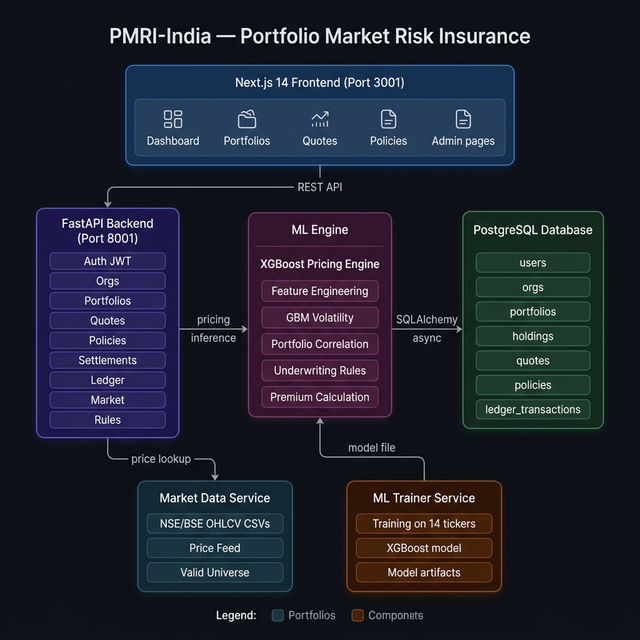

# 🛡️ PMRI-India — Portfolio Market Risk Insurance

> **⚠️ DISCLAIMER:** Educational prototype only. NOT financial advice. NOT an IRDAI-approved insurance product. Not suitable for actual insurance or investment decisions.

**PMRI-India** is a full-stack fintech application that provides insurance-like **downside protection for NSE/BSE cash equity portfolios**. Retail and Institutional investors can upload their portfolio holdings, get an AI-priced insurance quote, bind it into an active policy, and receive automated settlement payouts when their portfolio drops below a configurable threshold.

---

## 🏗️ Architecture



### Component Overview

| Component | Technology | Role |
|-----------|------------|------|
| **Frontend** | Next.js 14, TailwindCSS, TypeScript | User-facing web app (dashboard, portfolio management, quotes, policies) |
| **Backend API** | FastAPI, SQLAlchemy async, Pydantic v2 | REST API server, business logic, auth, underwriting |
| **ML Pricing Engine** | XGBoost, NumPy, SciPy | Portfolio risk scoring, volatility modelling, premium calculation |
| **ML Trainer** | Python, GBM simulator | Trains XGBoost model on 14 NSE/NASDAQ tickers at Docker build time |
| **Database** | PostgreSQL 16 | Stores users, orgs, portfolios, quotes, policies, ledger |
| **Market Data** | CSV OHLCV feed | NSE/NASDAQ daily price data, 14 tickers, 5-year history |

---

## 🔄 Application Flow

```
User → Upload Portfolio CSV
         │
         ▼
    Holdings validated against NSE/BSE universe
         │
         ▼
    Request Insurance Quote
    ┌────────────────────────────────────────┐
    │  ML Engine computes:                   │
    │  • 20-day rolling volatility per stock │
    │  • Portfolio correlation matrix        │
    │  • Tail-loss probability (XGBoost)     │
    │  • Expected payout + risk margin       │
    └────────────────────────────────────────┘
         │
         ▼
    Underwriting check (concentration, exposure limits)
         │
         ▼
    Quote displayed → User clicks "Bind Policy"
         │
         ▼
    Policy ACTIVE → Ledger entry: PREMIUM_PAID
         │
         ▼
    At policy maturity (Intraday/Weekly/Monthly):
    Settlement engine checks portfolio return Rp
    ┌─────────────────────────────────────────────────────────┐
    │  If Rp < loss_threshold  → payout to user              │
    │  If Rp > profit_threshold → surplus rebate to user     │
    │  Otherwise              → no payment (insurer profits)  │
    └─────────────────────────────────────────────────────────┘
         │
         ▼
    Policy → SETTLED, ledger updated
```

---

## 📁 Project Structure

```
pmri-india/
├── docker-compose.yml          # Orchestrates all 4 services
├── .env.example                # Environment variable template
├── README.md
│
├── backend/                    # FastAPI Application
│   ├── Dockerfile
│   ├── requirements.txt
│   └── app/
│       ├── main.py             # App entrypoint, lifespan, CORS, router registration
│       ├── core/
│       │   ├── config.py       # Pydantic settings from env
│       │   ├── database.py     # Async SQLAlchemy engine + session factory
│       │   ├── deps.py         # FastAPI dependency injection (get_current_user)
│       │   ├── security.py     # JWT (HS256), bcrypt password hashing
│       │   └── logging.py      # JSON structured logging
│       ├── models/             # SQLAlchemy ORM models
│       │   ├── user.py         # User, tier (RETAIL / INSTITUTIONAL_*)
│       │   ├── org.py          # Org, OrgMember (role: OWNER/MEMBER)
│       │   ├── portfolio.py    # Portfolio, Holding
│       │   ├── quote.py        # Quote (pricing result + eligibility)
│       │   └── policy.py       # Policy, LedgerTransaction, PolicySettlement
│       ├── routers/            # 9 API route modules
│       │   ├── auth.py         # POST /auth/login, /auth/register, /auth/me
│       │   ├── orgs.py         # Org CRUD + member management
│       │   ├── portfolios.py   # Portfolio CRUD + CSV upload
│       │   ├── market.py       # GET /market/{symbol} — price history
│       │   ├── rules.py        # GET /rules — underwriting limits by tier
│       │   ├── quotes.py       # POST /quotes — request ML-priced quote
│       │   ├── policies.py     # Bind, list, activate, deactivate, delete
│       │   ├── settlements.py  # Trigger settlement run (admin/scheduler)
│       │   └── ledger.py       # Read-only ledger transaction log
│       └── services/
│           ├── market_service.py     # Loads OHLCV CSVs, price lookups
│           ├── ml_service.py         # XGBoost model loader + inference
│           ├── settlement_service.py # Portfolio return calculation + payout
│           └── audit_service.py      # Append-only audit log
│
├── frontend/                   # Next.js 14 App Router
│   ├── Dockerfile
│   ├── package.json
│   └── src/
│       ├── app/
│       │   ├── page.tsx            # Landing / redirect
│       │   ├── login/page.tsx      # JWT login form
│       │   ├── signup/page.tsx     # Registration form
│       │   ├── dashboard/page.tsx  # Stats, coverage timeline, charts
│       │   ├── portfolios/page.tsx # Portfolio list with hover actions
│       │   ├── portfolios/[id]/page.tsx  # Holdings detail + CSV upload
│       │   ├── quotes/new/page.tsx # Quote request form (slider + manual input)
│       │   ├── quotes/[id]/page.tsx      # Quote detail + "Bind Policy" button
│       │   ├── policies/page.tsx         # Policy list: Activate/Deactivate/Delete
│       │   ├── policies/[id]/page.tsx    # Policy detail + ledger timeline
│       │   └── admin/page.tsx            # Admin settlement trigger
│       ├── components/
│       │   └── Navbar.tsx          # Navigation + org switcher
│       └── lib/
│           ├── api.ts              # All API calls (typed fetch wrappers)
│           ├── auth.tsx            # React Context: JWT + user state
│           └── utils.ts            # formatINR(), formatDate()
│
├── ml/                         # ML Pricing Engine (shared library)
│   ├── data/                   # Demo OHLCV CSVs (14 tickers × 5 years)
│   │   ├── RELIANCE.NSE.csv
│   │   ├── TCS.NSE.csv
│   │   ├── INFY.NSE.csv
│   │   ├── HDFCBANK.NSE.csv
│   │   ├── ICICIBANK.NSE.csv
│   │   ├── WIPRO.NSE.csv
│   │   ├── BHARTIARTL.NSE.csv
│   │   ├── SBIN.NSE.csv
│   │   ├── ITC.NSE.csv
│   │   ├── HINDUNILVR.NSE.csv
│   │   ├── AAPL.NASDAQ.csv
│   │   ├── MSFT.NASDAQ.csv
│   │   ├── GOOGL.NASDAQ.csv
│   │   ├── TSLA.NASDAQ.csv
│   │   └── valid_universe.csv  # Symbol → exchange → sector registry
│   ├── symbols.py              # NSE/BSE normalization, reject F&O/ETFs
│   ├── features.py             # Rolling vol, drawdown, skew, kurt, correlation
│   ├── model.py                # XGBoost wrapper + heuristic fallback
│   ├── pricing.py              # Tier-aware underwriting + premium formula
│   └── train.py                # Training script (runs in ml-trainer container)
│
└── docs/
    ├── architecture.png        # System architecture diagram
    ├── architecture.md         # Mermaid diagrams (5 views)
    └── api-examples.md         # cURL / HTTPie request examples
```

---

## 🚀 Quickstart

### Prerequisites
- [Docker Desktop](https://www.docker.com/products/docker-desktop/) with WSL2 backend
- 8 GB RAM recommended (ML training + 4 containers)

### Run

```bash
git clone https://github.com/YOUR_USERNAME/pmri-india.git
cd pmri-india
cp .env.example .env
docker compose up --build
```

> First build: ~5–8 minutes (trains XGBoost model, installs Python/Node deps)

| Service | URL |
|---------|-----|
| 🖥️ Frontend | http://localhost:3001 |
| ⚙️ Backend API | http://localhost:8001 |
| 📖 Swagger Docs | http://localhost:8001/docs |

---

## 👤 Demo Accounts

| Email | Password | Type | Tier |
|-------|----------|------|------|
| `retail@demo.in` | `demo1234` | Retail User | RETAIL |
| `priya@acmefund.in` | `demo1234` | Institutional | INSTITUTIONAL_BASIC |
| `raj@acmefund.in` | `demo1234` | Institutional (Owner) | INSTITUTIONAL_BASIC |
| `admin@pmri.in` | `admin1234` | Admin | — |

**Demo Org:** `Acme Capital Fund` (switch using the org switcher in the navbar)

---

## 📊 Demo Walkthrough

### As a Retail User
1. Login at **http://localhost:3001/login** as `retail@demo.in`
2. Go to **Portfolios** → Create a new portfolio
3. Upload a CSV (`symbol,exchange,quantity`):
   ```
   RELIANCE,NSE,50
   TCS,NSE,20
   INFY,NSE,100
   ```
4. Click **Get Insurance Quote** → set notional amount and term
5. On the quote page → click **🛡️ Bind Policy**
6. View your active policy at **Policies**
7. Deactivate / Re-activate the policy using the toggle buttons

### As Admin (Settlement Trigger)
1. Login as `admin@pmri.in`
2. Go to **Admin** → trigger a settlement run
3. All eligible matured policies are settled automatically

---

## 🤖 ML Pricing Model

### Features Computed Per Stock
| Feature | Description |
|---------|-------------|
| `vol_20d` | 20-day rolling annualized volatility |
| `max_drawdown` | Max peak-to-trough drawdown in window |
| `skew` | Return distribution skewness |
| `kurt` | Excess kurtosis (tail fatness) |
| `mean_return` | Mean daily return |
| `vol_ratio` | Short-term vs long-term vol ratio |

### Portfolio Aggregation
```
portfolio_vol = sqrt(Σᵢ Σⱼ wᵢ × wⱼ × σᵢ × σⱼ × ρᵢⱼ)

where ρᵢⱼ = Pearson correlation on overlapping 20-day return windows
```

### Premium Formula
```
premium = expected_payout + risk_margin + capital_fee

  expected_payout = notional × coverage_rate × tail_loss_prob × avg_excess_loss
  risk_margin     = expected_payout × tier_margin_pct
  capital_fee     = notional × 0.0003 × (term_days / 30)
```

---

## 📋 Underwriting Rules

| Rule | RETAIL | INST. BASIC | INST. PREMIUM |
|------|--------|-------------|---------------|
| Max notional per policy | ₹10L | ₹1Cr | ₹5Cr |
| Max open exposure | ₹25L | ₹5Cr | ₹25Cr |
| Max single-stock weight | 80% | 85% | 90% |
| Risk margin on premium | 30% | 20% | 15% |

---

## 💰 Settlement Payoff

Let `Rp = (V_end - V_start) / V_start` (portfolio return over policy term)

```
If Rp < loss_threshold (L):
    payout = notional × coverage_rate × (|Rp| - |L|)   [capped at max_payout]

If Rp > profit_threshold (U):
    rebate = notional × profit_share_rate × (Rp - U)

Otherwise: no payment
```

---

## 🛠️ API Endpoints

| Method | Endpoint | Description |
|--------|----------|-------------|
| `POST` | `/auth/login` | Get JWT token |
| `POST` | `/auth/register` | Create account |
| `GET` | `/portfolios` | List user portfolios |
| `POST` | `/portfolios` | Create portfolio |
| `POST` | `/portfolios/{id}/upload` | Upload holdings CSV |
| `POST` | `/quotes` | Request ML-priced quote |
| `GET` | `/quotes/{id}` | Get quote detail |
| `POST` | `/policies` | Bind quote → active policy |
| `PATCH` | `/policies/{id}/activate` | Re-activate INACTIVE policy |
| `PATCH` | `/policies/{id}/deactivate` | Deactivate ACTIVE policy |
| `DELETE` | `/policies/{id}` | Delete non-ACTIVE policy |
| `GET` | `/ledger` | View transaction ledger |
| `POST` | `/settlements/run` | Trigger settlement (admin) |
| `GET` | `/market/{symbol}` | Get price history for symbol |

Full interactive docs: **http://localhost:8001/docs**

---

## 🔒 Security

- **JWT (HS256)** — stateless auth, configurable expiry
- **bcrypt** — password hashing (passlib)
- **CORS** — restricted to frontend origin in production
- **Role-based access** — org Owner vs Member, Admin flag
- **Append-only ledger** — no UPDATE/DELETE on `ledger_transactions`

---

## 📦 Environment Variables

Copy `.env.example` to `.env` and configure:

```env
DATABASE_URL=postgresql+asyncpg://pmri_india:pmri_india@db:5432/pmri_india
SECRET_KEY=your-secret-key-here
ACCESS_TOKEN_EXPIRE_MINUTES=1440
LOG_LEVEL=INFO
FRONTEND_ORIGIN=http://localhost:3001
```

---

## 🏛️ Key Design Decisions

1. **Cash equities only** — F&O, ETFs with non-equity underlying, SME, unlisted instruments are rejected by the symbol validator
2. **Symbol format** — `SYMBOL.NSE` or `SYMBOL.NASDAQ` internally; user CSV uses `SYMBOL,EXCHANGE,QTY`
3. **Price carry-forward** — missing prices on holidays/weekends use last available close
4. **Async throughout** — FastAPI + SQLAlchemy async for high concurrency
5. **Pydantic v2 schemas** — strict validation with model_validate for ORM serialization
6. **Eager-load relationships** — all SQLAlchemy queries use `selectinload` to avoid `MissingGreenlet` in async context
7. **Ledger immutability** — enforced at application layer; premium, payout, and rebate are separate entries
8. **ML retraining** — model trained once at Docker build time; retrain periodically via `ml-trainer` service in production

---

## 🗺️ Roadmap

- [ ] Real-time NSE WebSocket price feed integration
- [ ] SMS/email notifications on policy settlement
- [ ] IRDAI compliance module (KYC, premium receipts)
- [ ] Portfolio rebalancing alerts
- [ ] Mobile app (React Native)
- [ ] Multi-currency support (USD hedging)

---

## 📄 License

MIT License — see [LICENSE](LICENSE) for details.

---

<div align="center">
  Built with ❤️ for the Indian fintech ecosystem<br/>
  <strong>Not for production use. Educational purposes only.</strong>
</div>
