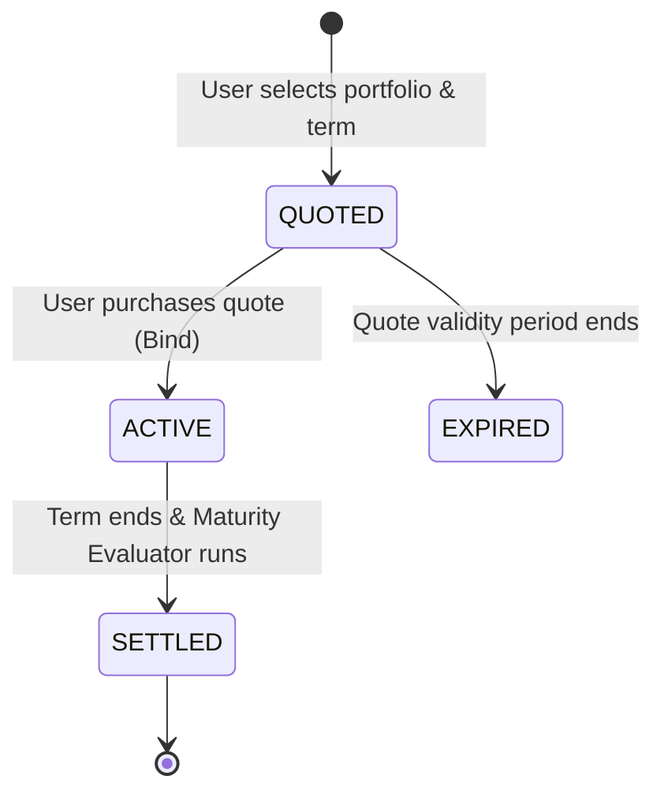
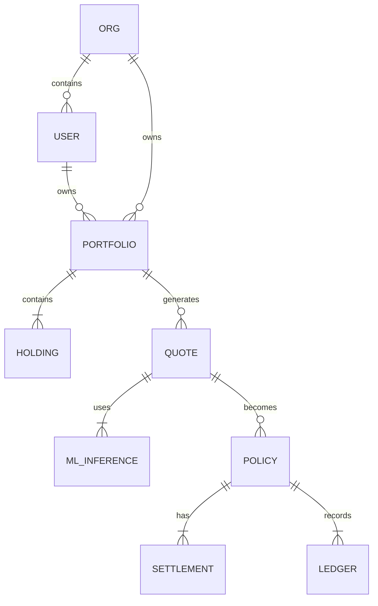

# PMRI Global — Architecture Documentation

This document describes the architecture of the Portfolio Market Risk Insurance (PMRI) Global unified platform.

## 1. System Architecture

The system is composed of four main Docker containers:

```mermaid
graph TD
    subgraph "Frontend Layer"
        UI[Next.js + Tailwind CSS]
    end

    subgraph "Backend Layer"
        API[FastAPI Backend]
        DB[(PostgreSQL)]
        ML[XGBoost ML Module]
    end

    subgraph "Infrastructure"
        Cron[APScheduler (Settlement Engine)]
    end

    UI -- REST / JSON --> API
    API -- Read/Write --> DB
    API -- In-Memory Inference --> ML
    Cron -- Triggers --> API
```

## 2. Policy Lifecycle State Machine

Policies follow a strict append-only lifecycle:



## 3. Portfolio Risk Model

The pricing engine uses a bottom-up approach to calculate risk:

```mermaid
graph TD
    A[Holdings (NSE & NASDAQ)] --> B[Fetch trailing 252d prices]
    B --> C[Compute single-stock volatility]
    B --> D[Compute single-stock tail-loss]
    C --> E[XGBoost Inference]
    D --> E
    E --> F[Correlation-Adjusted Portfolio Risk]
    F --> G[Tier Margins Applied]
    G --> H[Final Premium Calculation]
```

## 4. Payoff Formula

The insurance payoff is governed by the $R$ (Return) metric:

```math
R = \frac{P_{end} - P_{start}}{P_{start}}
```

```mermaid
graph TD
    Start[Calculate R] --> Cond1{R < Loss Threshold?}
    Cond1 -- Yes --> Payout[Payout = Notional * Coverage * (abs(R) - abs(L))]
    Cond1 -- No --> Cond2{R > Profit Threshold?}
    Cond2 -- Yes --> Surplus[Surplus = Notional * ProfitShare * (R - U)]
    Cond2 -- No --> Zero[No Payout, No Surplus]
```

## 5. ER Diagram (Core Entities)


